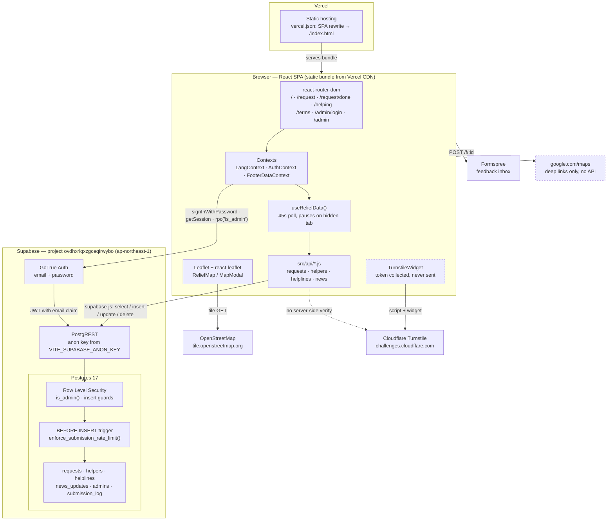

# AxomRelief — Technical Architecture

> Generated by inspecting the codebase at commit `1393536` (branch `main`) and the live
> Supabase project `ovdhxrlqxzgceqirwybo`. Everything below describes what is actually
> implemented. Features that were discussed but never built are called out explicitly in
> [§9 Known gaps](#9-known-gaps-and-todos).

---

## 1. Project overview

AxomRelief is a bilingual (English/Assamese) flood-relief helpline for three districts of
upper Assam — Sivasagar, Charaideo and Jorhat. Members of the public either submit a help
request (name, address, phone numbers, number of people, supplies needed, priority, optional
GPS pin) or register as a rescuer declaring which districts they cover and which supplies
they can bring; both lists appear as cards and as pins on a shared live map.

An admin dashboard, gated behind Supabase Auth and a database-enforced admin allowlist, lets
operators triage requests through a `looking → in_progress → resolved` lifecycle, hide or
delete rows, manage helpline numbers and news updates, and export either list to CSV.

---

## 2. Tech stack

Everything is a static React SPA talking directly to Supabase's auto-generated REST API.
**There is no backend service, no serverless function and no Supabase Edge Function in this
repo.**

| Layer | Technology | Version (installed) |
|---|---|---|
| UI framework | React | 18.3.1 |
| DOM renderer | react-dom | 18.3.1 |
| Routing | react-router-dom (`BrowserRouter`) | 6.30.4 |
| Build tool | Vite | 5.4.21 |
| React plugin | @vitejs/plugin-react | 4.7.0 |
| Database client | @supabase/supabase-js | 2.111.0 |
| Map engine | Leaflet | 1.9.4 |
| Map bindings | react-leaflet | 4.2.1 |
| Linting | eslint + eslint-plugin-react + eslint-plugin-react-hooks | 8.57.1 / 7.x / 4.x |
| Runtime (dev) | Node | v26.5.1 |

Declared ranges in [package.json](package.json) are caret ranges (`^18.3.1`, `^2.45.4`, …);
the table shows what is actually in `node_modules`. Note `@supabase/supabase-js` has drifted
from the declared `^2.45.4` to 2.111.0.

**Services and how they are used**

| Service | Status | Where |
|---|---|---|
| **Supabase** — Postgres, PostgREST, Auth | Live and load-bearing | [src/supabaseClient.js](src/supabaseClient.js), all of `src/api/` |
| **Supabase Auth** — email + password | Live, admin login only. No public sign-up; accounts are created by hand in the dashboard | [src/context/AuthContext.jsx](src/context/AuthContext.jsx), [src/pages/AdminLogin.jsx](src/pages/AdminLogin.jsx) |
| **OpenStreetMap tiles** | Live. No key, no billing, no quota | [src/components/ReliefMap.jsx:13](src/components/ReliefMap.jsx#L13) |
| **Cloudflare Turnstile** | Widget renders, **token is never verified** — see §9 and §10 | [src/components/TurnstileWidget.jsx](src/components/TurnstileWidget.jsx) |
| **Formspree** | Live. Backs the footer feedback form only | [src/components/FeedbackSheet.jsx:50](src/components/FeedbackSheet.jsx#L50) |
| **Google Maps** | **Not an integration.** Only plain deep links of the form `https://www.google.com/maps/search/?api=1&query=<lat>,<lng>`. No SDK, no API key read by any code | [ReliefMap.jsx:138](src/components/ReliefMap.jsx#L138), [AdminDashboard.jsx:101](src/pages/AdminDashboard.jsx#L101) |
| **MSG91 / OTP / SMS verification** | **Not implemented anywhere.** A repo-wide search for `msg91`, `otp`, `twilio`, `sendsms` returns zero hits in `src/`, `supabase/` and `README.md` | — |

**Styling** — hand-written CSS, no framework, no CSS-in-JS, no preprocessor. Five plain
stylesheets imported once in [src/main.jsx](src/main.jsx): `tokens.css` (CSS custom
properties for the palette), `base.css`, `overlays.css`, `footer.css`, `admin.css`. Component
files use `className` plus occasional inline `style` objects for one-off values. Leaflet's own
`leaflet/dist/leaflet.css` is imported by `ReliefMap.jsx`.

**Internationalisation** — a home-grown two-column table in
[src/i18n/strings.js](src/i18n/strings.js) (193 lines). `lang` is an index: `0` = English,
`1` = Assamese, held in `LangContext` React state. It is **not** persisted to localStorage or
the URL, so the choice resets on every page load.

---

## 3. System architecture



**The important structural fact:** there is no application server. The browser holds the
Supabase anon key (it ships in the JS bundle) and talks straight to PostgREST. Every
authorization and abuse-control decision is therefore made *inside Postgres* — RLS policies
and triggers — because nothing else sits in the request path. This is stated explicitly in the
migration comments, e.g. [0003_rate_limit_and_hardening.sql](supabase/migrations/0003_rate_limit_and_hardening.sql).

---

## 4. Database schema

Verified against the live database, not just the migration files. Row counts are as of
inspection.

### `public.requests` — help requests (157 rows)

| Column | Type | Notes / constraints |
|---|---|---|
| `id` | `uuid` PK | `gen_random_uuid()` |
| `name` | `text` NOT NULL | length 1–80 |
| `district` | `text` NOT NULL | `in ('Sivasagar','Charaideo','Jorhat')` |
| `location` | `text` NOT NULL | length 1–200 |
| `contact_number` | `text` NOT NULL | `~ '^[6-9][0-9]{9}$'` — the primary, dialled first, and the key the rate limiter hashes |
| `contact_numbers` | `text[]` NOT NULL `'{}'` | ≤ 4 extras; every element validated via `array_to_string(...) ~ '^[6-9][0-9]{9}(,[6-9][0-9]{9})*$'` |
| `num_people` | `integer` NOT NULL `1` | `>= 1` and `<= 5000` (raised from 500 in 0007) |
| `needs` | `text[]` NOT NULL `'{}'` | ≤ 10 elements |
| `needs_other` | `text` NULL | ≤ 100 chars |
| `priority` | `text` NOT NULL | `in ('critical','urgent','needed')` |
| `boat_required` | `boolean` NULL | |
| `notes` | `text` NULL | ≤ 500 chars |
| `has_live_location` | `boolean` NOT NULL `false` | true = the pin is a real GPS fix |
| `live_lat`, `live_lng` | `double precision` NULL | raw geolocation reading |
| `lat`, `lng` | `double precision` NULL | what the map renders: the GPS fix, or a ±0.045° jitter around the district centre |
| `status` | `text` NOT NULL `'looking'` | `in ('looking','in_progress','resolved')`. The admin ranked view treats "open" as *not resolved* |
| `resolved_at` | `timestamptz` NULL | Stamped by the `requests_stamp_resolved_at` trigger when `status` becomes `resolved`, cleared on reopen. Null for the 44 rows resolved before migration 0013 |
| *`priority_score`* | *computed, not stored* | PostgREST computed column from `public.priority_score(requests)`. Must be requested by name — it is not part of `select=*` |
| `helper_name` | `text` NULL | see §9 — only ever written by a trigger path that is currently unreachable |
| `helper_from` | `text` NULL | **never written by any code** |
| `helper_eta_minutes` | `integer` NULL | **never written by any code** |
| `helper_en_route_at` | `timestamptz` NULL | **never written by any code** |
| `hidden` | `boolean` NOT NULL `false` | admin soft-delete |
| `created_at` | `timestamptz` NOT NULL `now()` | |

Indexes: `created_at desc`, `district`, `priority`, `hidden`, `status`.

### `public.helpers` — rescuer registrations (337 rows)

| Column | Type | Notes / constraints |
|---|---|---|
| `id` | `uuid` PK | `gen_random_uuid()` |
| `name` | `text` NOT NULL | length 1–80 |
| `contact_number` | `text` NOT NULL | `~ '^[6-9][0-9]{9}$'` |
| `contact_numbers` | `text[]` NOT NULL `'{}'` | ≤ 4 extras, same joined-regex check |
| `districts_covered` | `text[]` NOT NULL `'{}'` | ≤ 3. **Empty means "everywhere"** — the UI treats a blank list as covering all districts so legacy rows don't vanish behind a filter |
| `areas_text` | `text` NULL | ≤ 200 chars, free-text local areas |
| `areas_covered` | `text` NULL | legacy duplicate of `areas_text`, still written by `registerHelper` |
| `supplies` | `text[]` NOT NULL `'{}'` | ≤ 10, same category keys as `requests.needs` — this is what makes match-scoring possible |
| `supplies_other` | `text` NULL | ≤ 100 chars |
| `what_given` | `text` NULL | ≤ 200 chars, human-readable rendering of `supplies` |
| `boat_available` | `boolean` NULL | |
| `notes` | `text` NULL | ≤ 500 chars |
| `lat`, `lng` | `double precision` NULL | always a jitter around the first covered district — rescuers never share a real GPS pin |
| `hidden` | `boolean` NOT NULL `false` | |
| `created_at` | `timestamptz` NOT NULL `now()` | |

Indexes: `created_at desc`, `hidden`.

### `public.helplines` — control-room numbers in the footer (4 rows)

`id uuid PK` · `label text NOT NULL` (1–60) · `phone_number text NOT NULL` (3–20, deliberately
loose so landlines and `1077` fit) · `sort_order integer NOT NULL 0` · `created_at timestamptz`.
Index on `sort_order`.

### `public.news_updates` — admin-posted updates (6 rows)

`id uuid PK` · `message text NOT NULL` (1–500) · `created_at timestamptz`. Index on
`created_at desc`.

### `public.admins` — the authorization allowlist (1 row)

`email text PK` · `note text` · `created_at timestamptz`. Added in migration 0010. Rows are
inserted by hand at the SQL editor; there is no API path that can write to it.

### `public.submission_log` — rate-limiter ledger (4 rows)

`id bigserial PK` · `client_ip text NOT NULL` · `phone_hash text NULL` (md5 of the last 10
digits) · `created_at timestamptz`. Indexes on `(client_ip, created_at desc)` and
`(phone_hash, created_at desc)`. RLS enabled with **zero policies**, so it is unreachable
through the API; only the `security definer` trigger touches it.

### `public.request_updates` — score input, added in 0013 (0 rows)

`id uuid PK` · `request_id uuid NOT NULL REFERENCES requests(id) ON DELETE CASCADE` ·
`note text` (≤500) · `created_at timestamptz`. Index on `request_id`. Admin-only RLS.
**Nothing writes to it yet** — see §9.

### Relationships

`request_updates.request_id → requests.id` (added in 0013) is the **only** foreign key in the
schema. Every other table stands alone. A request and
the rescuer who attends it are linked only by the denormalised `requests.helper_name` text
column, not by a reference to `helpers.id`. `admins.email` is matched against the JWT email
claim at query time rather than joined to `auth.users`.

### RLS policies (live, verified)

Every table has `rls_enabled = true`.

| Table | Command | Roles | `USING` | `WITH CHECK` |
|---|---|---|---|---|
| `requests` | SELECT | anon, authenticated | `hidden = false` | — |
| `requests` | SELECT | authenticated | `is_admin()` | — |
| `requests` | INSERT | anon, authenticated | — | `hidden = false AND helper_name IS NULL AND helper_from IS NULL AND helper_eta_minutes IS NULL AND helper_en_route_at IS NULL AND created_at > now() - '5 min'` |
| `requests` | UPDATE | authenticated | `is_admin()` | `is_admin()` |
| `requests` | DELETE | authenticated | `is_admin()` | — |
| `helpers` | SELECT | anon, authenticated | `hidden = false` | — |
| `helpers` | SELECT | authenticated | `is_admin()` | — |
| `helpers` | INSERT | anon, authenticated | — | `hidden = false AND created_at > now() - '5 min'` |
| `helpers` | UPDATE | authenticated | `is_admin()` | `is_admin()` |
| `helpers` | DELETE | authenticated | `is_admin()` | — |
| `helplines` | SELECT | anon, authenticated | `true` | — |
| `helplines` | INSERT / UPDATE / DELETE | authenticated | `is_admin()` | `is_admin()` |
| `news_updates` | SELECT | anon, authenticated | `true` | — |
| `news_updates` | INSERT / UPDATE / DELETE | authenticated | `is_admin()` | `is_admin()` |
| `admins` | SELECT | authenticated | `is_admin()` | — |
| `submission_log` | *(none)* | — | — | — |

There is **no public UPDATE path.** Migration 0008 briefly added an anon "claim this request"
policy; 0009 dropped it when the button was removed from the UI. The
`guard_public_request_update()` trigger it relied on is still installed, deliberately, so
re-enabling the feature is a one-line policy change rather than a fresh security review.

### Database functions and triggers

| Object | Kind | Purpose |
|---|---|---|
| `is_admin()` | `sql`, `stable`, `security definer` | `true` when the JWT's email claim (case-insensitive) is in `admins`. Executable by `anon` and `authenticated`; the frontend also calls it via `supabase.rpc('is_admin')` purely to decide what to render |
| `enforce_submission_rate_limit()` | `plpgsql`, `security definer` | `BEFORE INSERT` on both `requests` and `helpers`. Real admins are exempt. Limits: **5 inserts per IP / 10 min** and **3 per phone number / 10 min**. Raises `rate_limit_exceeded`, which the client matches on as a string |
| `guard_public_request_update()` | `plpgsql`, `security definer` | `BEFORE UPDATE` on `requests`. Guards only the `anon` path; rebuilds the row from `OLD` so any column added later is protected by default. Currently unreachable — no anon UPDATE policy exists |
| `priority_score(requests)` | `sql`, `stable` | Admin triage score, computed per query, never stored. `(priority×50) + (max need weight×20) + LEAST(num_people,20) + (hours×0.5) − (update_count×15)`. Exposed by PostgREST as a computed column |
| `need_weight(text)` | `sql`, `immutable` | Per-need weights: medical/rescue 3; water/food/sanitation/baby_care 2; clothes/other 1 |
| `stamp_resolved_at()` | `plpgsql` | `BEFORE UPDATE` on `requests`. Sets `resolved_at` on transition into `resolved`, clears it on reopen |

Both trigger functions have `EXECUTE` revoked from `public`, `anon` and `authenticated`.

### Migrations

`supabase/migrations/0001` … `0012`. Applied migration history on the live project:
`rate_limit_and_hardening`, `phone_rate_limit`, `number_list_and_helper_notes`,
`raise_people_cap`, `request_status`, `fix_request_update_guard_role_check`,
`drop_public_claim`, `real_admin_authorization`, `export_state`.

`0012_drop_export_state.sql` is **written but not yet applied** — `export_state` still exists
in the live database with 1 row.

Two SQL files live outside the migration chain on purpose:
- [supabase/seed.sql](supabase/seed.sql) — demo helplines, news, requests and helpers.
- [supabase/reset_public_data.sql](supabase/reset_public_data.sql) — destructive wipe of all
  public data, keeping helplines. Kept out of `migrations/` so `supabase db push` can never
  run it against live flood data.

---

## 5. Folder and file structure

```
axomRelief/
├── index.html                  Vite entry HTML; title, theme-color, favicon, #root
├── vite.config.js              Vite + React plugin. No aliases, no proxy, no custom build config
├── vercel.json                 One rewrite: /(.*) → /index.html (SPA deep links)
├── package.json                Deps and the four scripts: dev, build, preview, lint, check
├── .env / .env.example         Local env (gitignored) and its documented template
├── README.md                   Setup guide — partly stale, see §9
├── ARCHITECTURE.md             This document
├── public/
│   └── robots.txt
├── .claude/
│   └── launch.json             Dev-server config for the Claude Code browser preview (npm run dev, port 5173)
├── supabase/
│   ├── migrations/0001…0012    Forward-only schema history; the authority on the schema
│   ├── seed.sql                Demo data for a fresh database
│   └── reset_public_data.sql   Manual destructive wipe, deliberately not a migration
└── src/
    ├── main.jsx                Root render: StrictMode → BrowserRouter → Lang → Auth → FooterData → App
    ├── App.jsx                 Route table, scroll-reset on navigation, hides the footer on /admin
    ├── supabaseClient.js       Single supabase-js client + `supabaseConfigured` flag
    ├── api/                    Every database call in the app; nothing else imports supabase directly
    │   ├── requests.js         fetchVisible / fetchAllForAdmin / submit / setStatus / setHidden / delete
    │   ├── helpers.js          fetchVisible / fetchAllForAdmin / register / setHidden / delete
    │   ├── helplines.js        fetch / add / update / delete
    │   └── news.js             fetch / add / update / delete
    ├── context/
    │   ├── LangContext.jsx     lang (0=EN, 1=AS) + the resolved string table
    │   ├── AuthContext.jsx     Supabase session, signIn/signOut, isAdmin via rpc('is_admin')
    │   └── FooterDataContext.jsx  Helplines + news, fetched once, refetch() after admin edits
    ├── hooks/
    │   └── useReliefData.js    Shared requests+helpers fetch, 45s poll, pauses on a hidden tab
    ├── pages/
    │   ├── Home.jsx            Live map, the two placards, sticky CTA bar
    │   ├── RequestForm.jsx     "I want help" form + the active-rescuers list below it
    │   ├── RequestDone.jsx     Post-submit confirmation
    │   ├── Helping.jsx         Rescuer registration + the request queue, map, filters, tabs
    │   ├── AdminLogin.jsx      Username→email expansion, password sign-in
    │   ├── AdminDashboard.jsx  Five tabs: Requests, Rescuers, News, Helplines, Map
    │   └── Terms.jsx           Terms text
    ├── components/             15 presentational/interactive components
    │   ├── ReliefMap.jsx       Leaflet map: pins, popups, fit-to-markers, focus-on-row
    │   ├── MapModal.jsx        Full-screen map overlay (Escape to close)
    │   ├── TurnstileWidget.jsx Cloudflare widget with test-key and script-failure fallbacks
    │   ├── PhoneFields.jsx     Primary + up to four extra number inputs
    │   ├── PhoneButtons.jsx    tel: buttons for every number on a row
    │   ├── ListControls.jsx    Shared search / district / status / when / sort controls
    │   ├── Pager.jsx           Pagination UI; re-exports the paging helpers
    │   ├── HelperCard.jsx      Rescuer card
    │   ├── ShareButton.jsx     Web Share API with clipboard fallback
    │   ├── FeedbackSheet.jsx   Formspree feedback form
    │   ├── SiteFooter.jsx      Auto-scrolling news band, helplines, operator contacts
    │   ├── Sheet.jsx           Generic bottom-sheet/modal shell
    │   ├── ClampText.jsx       Expandable long text
    │   ├── TermsCheckbox.jsx   Terms agreement checkbox
    │   ├── Header.jsx          Logo + language toggle
    │   ├── Req.jsx             Red "required field" asterisk
    │   └── EyeIcon.jsx         Icon
    ├── utils/                  Pure logic, all covered by selfcheck.js
    │   ├── phone.js            Normalise/validate Indian mobiles; phoneList/cleanContacts
    │   ├── mapGeo.js           District centres, region bounds, jitter, row→marker mapping
    │   ├── priority.js         Priority metadata, match scoring, byAge (FIFO) sorting
    │   ├── status.js           Status metadata + safe statusOf() fallback
    │   ├── listFilter.js       The one filter chain behind all four lists
    │   ├── search.js           Cross-field text/number search
    │   ├── paging.js           PAGE_SIZE=10, pageSlice, pageWindow
    │   ├── time.js             timeAgo, formatDate, matchesWhen, toTel
    │   ├── share.js            Share-text builders for requests and rescuers
    │   ├── csv.js              CSV escaping + formula-injection neutralisation + download
    │   ├── rateLimit.js        Detects the trigger's rate_limit_exceeded error
    │   └── selfcheck.js        ~140 assertions over the utils — the project's test suite
    ├── i18n/strings.js         EN/AS string table, NEEDS categories, DISTRICTS
    ├── styles/                 tokens · base · overlays · footer · admin (plain CSS)
    └── assets/                 Logo and placard PNGs
```

---

## 6. Key flows

### 6.1 Submitting a help request

1. **`/request`** renders [RequestForm.jsx](src/pages/RequestForm.jsx). `useReliefData()`
   fetches requests + helpers so the rescuer list below the form is populated.
2. The user optionally taps **"Drop my live location pin"** → `shareLoc()` calls
   `navigator.geolocation.getCurrentPosition` with `enableHighAccuracy: true, timeout: 8000`;
   on any non-permission failure it retries coarse (`enableHighAccuracy: false`,
   `timeout: 15000`, `maximumAge: 120000`). A permission denial fails straight through. Success
   sets `hasLiveLocation`, `lat`, `lng`, `accuracy`.
3. `TurnstileWidget` renders in `interaction-only` mode and calls `onToken` with a real token,
   or with the sentinel string `'turnstile-unavailable'` if the script is blocked or errors.
4. **Submit** → `onSubmit()` runs client-side gates in order: honeypot (`company` non-empty →
   silently return), required fields, `contactsError()` phone validation, terms checkbox,
   then "a token exists" (any non-empty string passes).
5. `submitRequest(form)` in [src/api/requests.js:26](src/api/requests.js#L26) picks the map
   point — the exact GPS fix if shared, otherwise `jitterAroundDistrict(district)` — strips
   `'other'` out of `needs`, and splits `cleanContacts()` into `contact_number` (primary) plus
   `contact_numbers` (extras). One `insert(...).select().single()`.
6. **Server side:** the `requests` INSERT policy checks `hidden = false`, all four
   `helper_*` columns are NULL, and `created_at` is within 5 minutes. Then
   `enforce_submission_rate_limit()` fires — 5/IP and 3/phone per 10 minutes — and every
   length and format `CHECK` constraint runs.
7. Success → `navigate('/request/done')`. A thrown error is matched by `isRateLimited()` and
   shown as the friendly rate-limit string, otherwise as a generic retry message.

The Turnstile token is **never transmitted**. It gates only the local `if`.

### 6.2 Registering as a rescuer

1. **`/helping`** renders [Helping.jsx](src/pages/Helping.jsx); the registration panel is open
   by default.
2. Validation order in `submitHelper()`: honeypot → name → `contactsError()` → at least one
   district → at least one supply → terms → token present.
3. `registerHelper(form)` in [src/api/helpers.js:35](src/api/helpers.js#L35) writes both the
   machine-readable `supplies` array *and* the human sentence `what_given` (built by
   `suppliesText()`), writes `areas_text` and the legacy `areas_covered` to the same value, and
   places the pin with `jitterAroundDistrict(form.districts[0])` — rescuers never share real GPS.
4. Server side: the `helpers` INSERT policy (`hidden = false`, fresh `created_at`), the same
   rate-limit trigger, and the array/length constraints.
5. On success the page sets `registered`, scrolls to top (no route change, so `App`'s scroll
   reset doesn't fire), and `await refetch()` re-pulls both lists.

### 6.3 Viewing the map

Three surfaces share [ReliefMap.jsx](src/components/ReliefMap.jsx): Home (preview), Helping
(preview + `MapModal`), Admin → Map tab (interactive).

1. Rows → markers via `requestsToMarkers(requests, priorityMeta)` and
   `helpersToMarkers(helpers)` in [mapGeo.js](src/utils/mapGeo.js). Rows without numeric
   `lat`/`lng` are dropped; **`status = 'resolved'` requests are dropped from the map** while
   staying in the list.
2. `MapContainer` centres on `REGION_CENTER` at zoom 9, fenced by `maxBounds`
   `[[26.20, 93.55], [27.75, 95.75]]` with `maxBoundsViscosity: 1.0` and `minZoom: 9`.
   `TileLayer` pulls OSM tiles; `AttributionControl` carries the required credit.
3. `FitToMarkers` frames the actual pins (`fitBounds`, `maxZoom: 13`) and re-fits via a
   `ResizeObserver` — needed because Leaflet measures its container once, and the modal mounts
   before it expands.
4. Pins are `L.divIcon` coloured dots (green = request, orange = rescuer), not Leaflet's
   CDN-loaded PNG sprite. On Helping, request pins are plain green; the admin and request-form
   maps can pass `PRIORITY_META` to colour by priority.
5. Tapping a row's **📍 Show on map** → `showOnMap(r)` sets a fresh `focus` object (new
   identity every click, so re-tapping the same row re-centres a panned map) → `FocusOnPoint`
   calls `map.setView(..., 14)` and opens that marker's popup.
6. Popups show role, name, address, `tel:` links per number, and for requests a Google Maps
   deep link plus copyable `lat, lng`. `PopupWatcher` hides the legend and expand button while
   a popup is open so they can't cover it.

### 6.4 Admin dashboard

1. **`/admin/login`** → [AdminLogin.jsx](src/pages/AdminLogin.jsx). A bare username is expanded
   to `<username>@axomrelief.app`; `signIn(email, password)` calls
   `supabase.auth.signInWithPassword`.
2. `AuthContext` reacts to the session change and calls `supabase.rpc('is_admin')`. `isAdmin`
   is the RPC result, **not** `!!session` — that was the critical bug fixed by migration 0010.
3. **`/admin`** → [AdminDashboard.jsx](src/pages/AdminDashboard.jsx) branches three ways:
   still loading → spinner; signed in but not an admin → an explicit "this account is not an
   administrator" panel with a sign-out button (rather than a bounce back to login, which reads
   as a wrong password); no session → `<Navigate to="/admin/login" replace />`.
4. On `isAdmin`, it loads `fetchAllRequestsForAdmin()` and `fetchAllHelpersForAdmin()` — plain
   `select('*')` with no `hidden` filter, which returns hidden rows **only because** the
   `is_admin()` SELECT policy allows it. Helplines and news come from `FooterDataContext`.
5. Tabs and their actions:
   - **Requests** — export bar, `ListControls` (with status + when), then per row: share,
     a status `<select>` → `setRequestStatus()`, Hide/Unhide → `setRequestHidden()`,
     Delete → `deleteRequest()`. Each action re-runs `loadRequests()`.
   - **Rescuers** — same shape, minus status.
   - **News** / **Helplines** — inline add and edit forms; every mutation calls
     `footer.refetch()` so the site-wide footer stays in sync.
   - **Map** — both marker sets, `interactive`, hidden rows excluded.
6. **CSV export** — `exportBar()` calls `run(all)` directly when no filter is active. When
   `isFiltered()` is true it opens a `Sheet` asking "export the N shown, or all M?", because
   silently exporting the wrong set is only noticed after the file has been sent on.
   `toCsv()` + `downloadCsv()` handle quoting, formula-injection prefixing, and the UTF-8 BOM
   Excel needs for Assamese names.

---

## 7. Environment variables

Every variable the code actually reads is `VITE_`-prefixed, which means **Vite inlines it into
the public JS bundle**. None of them are secret in the "must not be exposed" sense — but see
the note on the Google Maps key below.

| Variable | Read at | Purpose | Exposure |
|---|---|---|---|
| `VITE_SUPABASE_URL` | [supabaseClient.js:3](src/supabaseClient.js#L3) | Supabase project REST/Auth endpoint | Client bundle (by design) |
| `VITE_SUPABASE_ANON_KEY` | [supabaseClient.js:4](src/supabaseClient.js#L4) | Anon PostgREST key. Safe to publish **only because** RLS is correct | Client bundle (by design) |
| `VITE_TURNSTILE_SITE_KEY` | [TurnstileWidget.jsx:38](src/components/TurnstileWidget.jsx#L38) | Cloudflare Turnstile site key. Site keys are public. Ignored on localhost; falls back to the always-pass test key `1x00000000000000000000BB` | Client bundle (by design) |
| `VITE_FORMSPREE_FORM_ID` | [FeedbackSheet.jsx:11](src/components/FeedbackSheet.jsx#L11) | Formspree form id for the footer feedback form | Client bundle (by design) |

If `VITE_SUPABASE_URL` or `VITE_SUPABASE_ANON_KEY` is missing, `supabaseConfigured` is `false`,
a console warning fires, and the client is built against a dummy URL so the app renders a
"Backend not configured" message instead of crashing at import time.

**Variables present in `.env` but read by no code in this repo:**

| Variable | Status |
|---|---|
| `VITE_GOOGLE_MAPS_API_KEY` | **Unused.** No code reads it. Because of the `VITE_` prefix it would be baked into the public bundle if it ever shipped — worth revoking and deleting |
| `VITE_GOOGLE_MAPS_MAP_ID` | **Unused.** Same |
| `SUPABASE_SERVICE_ROLE_KEY` | Present but **commented out**. Never read by frontend code |
| `SECRET_TOKEN`, `GROUP_ID`, `PORT`, `BAILEYS_LOG_LEVEL` | Leftovers from the removed WhatsApp bot. Dead |

`.env`, `.env.local` and `.env.*.local` are gitignored. [.env.example](.env.example) documents
only the four live variables and does not mention the Google Maps or WhatsApp ones.

---

## 8. Deployment

**Host:** Vercel, serving a static build. There are no serverless functions, no API routes and
no `api/` directory — a Vercel project here is pure static hosting plus one rewrite rule.

**[vercel.json](vercel.json)** is three lines:

```json
{ "rewrites": [{ "source": "/(.*)", "destination": "/index.html" }] }
```

That single rewrite is what makes client-side routing survive a hard refresh or a shared deep
link — without it, `GET /helping` or `/admin` would 404 at the CDN before React ever loaded.
It was added in commit `3a3b3f0` ("Serve index.html for client-side routes").

**Build:** Vercel auto-detects Vite. `npm run build` → `vite build` → `dist/`. No custom build
command, output directory or install command is configured; `vite.config.js` carries no
`base`, `build` or `define` overrides. `dist/` and `.vercel/` are gitignored.

**Environment:** the four `VITE_` variables must be set as Vercel Project → Environment
Variables. They are read at *build* time, so changing one requires a redeploy, not just a
restart.

**Database:** deployed separately from the frontend. Migrations go via `supabase db push` (or
pasted into the SQL editor); admin accounts are created by hand in Authentication → Users, and
their email must then be inserted into `public.admins`.

**Local scripts:** `npm run dev` (Vite, port 5173) · `npm run build` · `npm run preview` ·
`npm run lint` (eslint) · `npm run check` (`node src/utils/selfcheck.js` — currently passing,
all assertions green).

---

## 9. Known gaps and TODOs

**Never built, despite having been discussed:**

- **OTP / phone verification (MSG91 or otherwise) does not exist.** There is no code, no
  dependency, no env var and no database column for it anywhere in the repo. Phone numbers are
  validated for *shape* only (10 digits, first digit 6–9) in the browser and again by a `CHECK`
  constraint. Nobody proves they own the number they type.
- **Turnstile is not enforced.** The widget renders and produces a token, but the token is
  never sent anywhere and nothing verifies it against Cloudflare's `siteverify` endpoint. A
  script POSTing straight to PostgREST skips the widget entirely. This is documented candidly
  in [TurnstileWidget.jsx:41-51](src/components/TurnstileWidget.jsx#L41). Real enforcement
  needs a server-side check before the insert — which needs a server, which this architecture
  does not currently have. The protection that actually holds is the database rate limiter.
- **No server-side honeypot check either.** Both honeypots are client-side `if (company) return`.

**Deliberate simplifications marked `ponytail:` in the code:**

| Location | Shortcut | Stated upgrade path |
|---|---|---|
| [0003](supabase/migrations/0003_rate_limit_and_hardening.sql#L73), [0004](supabase/migrations/0004_phone_rate_limit.sql#L55) | `submission_log` swept inline on every write | Move to a `pg_cron` job if the table gets hot |
| [0004:49](supabase/migrations/0004_phone_rate_limit.sql#L49) | `md5` for `phone_hash`, not a salted KDF | Only a counting key; the table is RLS-unreachable. Not protection against someone with DB access |
| [priority.js:51](src/utils/priority.js#L51) | Match scoring counts overlapping supplies only | Add helper→requester distance once rescuers store a real pin instead of a district jitter |
| [ReliefMap.jsx:112](src/components/ReliefMap.jsx#L112) | No clipboard fallback | Text is on screen and selectable anyway |
| [AdminDashboard.jsx:60](src/pages/AdminDashboard.jsx#L60) | One `edit` state shared by the News and Helplines tabs | Only one tab is mounted at a time |

**Incomplete / dead code:**

- **`helper_from`, `helper_eta_minutes`, `helper_en_route_at` are never written by anything.**
  The admin dashboard renders them if present; no code path sets them. `helper_name` is written
  only by `guard_public_request_update()`, which is currently unreachable (0009 dropped the anon
  UPDATE policy). The dispatch feature these four columns were designed for is half-removed.
- **`helpers.areas_covered`** is a legacy duplicate of `areas_text`; `registerHelper` writes the
  same value to both.
- **`export_state` table still exists in the live database.** `0012_drop_export_state.sql` is
  written and committed-ready but **not yet applied**.
- **`request_updates` has no writer.** Migration 0013 created it as the source of the priority
  score's `update_count` term, but no feature logs an update, so the term contributes 0 to
  every row today. Wiring admin status changes or notes into it is what makes it live.
- **The score's age term is unbounded.** `hours_since_created × 0.5` grows forever, so a stale
  low-priority request eventually outranks a fresh critical one (+12/day, and a critical-vs-needed
  gap is 100 points ≈ 8 days). Capping the term is a one-line change if that becomes a problem.
- **The WhatsApp export bot has been deleted** from the working tree; its env vars linger in
  `.env`.
- **[README.md](README.md) is stale.** It states the map is "the same hand-drawn SVG
  illustration … not a real Leaflet/OpenStreetMap map" — the opposite of what
  `ReliefMap.jsx` now does. It also references a sibling design file
  (`../project/AxomRelief.dc.html`) that is not in this repo, tells you to run only
  `0001_init.sql`, and repeats the superseded claim that "any authenticated user is treated as
  an admin" — untrue since migration 0010.
- **Language choice is not persisted.** `LangContext` holds it in React state only; every
  reload reverts to English.
- **No error boundary.** A render-time throw in any page blanks the whole app.
- **Not a PWA.** No service worker, no manifest, no offline support — on a flood helpline where
  connectivity is patchy, this is worth noting.
- **`test.csv`** (45 bytes) is a stray untracked file in the project root.

---

## 10. Security notes

**The trust model in one line:** the anon key ships in the public JavaScript bundle, so the
browser is not a trust boundary — Postgres is the only enforcement point, and every control
lives there.

**What is public vs gated**

| Data | Anonymous visitor | Authenticated non-admin | Admin |
|---|---|---|---|
| Non-hidden requests (incl. names, addresses, phone numbers, GPS) | Read | Read | Read |
| Hidden requests | — | — | Read |
| Non-hidden rescuers | Read | Read | Read |
| Helplines, news | Read | Read | Read |
| Insert a request / rescuer | Yes (rate-limited) | Yes (rate-limited) | Yes (exempt) |
| Update / delete anything | — | — | Yes |
| `admins` list | — | — | Read only; no write path via the API |
| `submission_log` (IPs, phone hashes) | — | — | — (RLS with zero policies) |

Note that non-hidden requests are **fully public by design** — this is a helpline where
rescuers need names, addresses and phone numbers without logging in. Anyone with the anon key,
which is anyone who loads the site, can enumerate all 157 requests and 337 rescuers including
every phone number. That is the intended trade-off, but it is the largest privacy surface in
the system and worth stating plainly.

**Authorization.** `isAdmin` in the frontend decides only what to *render*. Authority is
`public.is_admin()`, a `security definer` function comparing the JWT's email claim against the
`admins` table, invoked inside every admin RLS policy. Migration 0010 replaced the original
`to authenticated using (true)` policies, under which any account — including one created via
public sign-up — could read hidden rows, hide live requests and permanently delete victim
records by calling PostgREST directly. Adding an admin requires a deliberate `INSERT` at the SQL
editor; a compromised session cannot self-promote.

**Service role key.** Not used anywhere in the frontend, and it must never be — anything
`VITE_`-prefixed lands in the public bundle. It appears in `.env` only as a commented-out line
left over from the deleted WhatsApp bot, which used it server-side to bypass RLS when reading
the export watermark. Since that bot is gone, **the key is no longer needed by anything in this
project and should be rotated** — it sat in a plaintext `.env` alongside a service that no
longer exists.

**Abuse controls, in order of how much they actually hold:**

1. **Database rate limiter** (real) — `BEFORE INSERT` trigger, 5 per IP and 3 per phone number
   per 10 minutes, using the first hop of `x-forwarded-for`. Unidentifiable callers share a
   single `'unknown'` bucket, so a stripped header throttles *harder* rather than opening a
   bypass. This is the only anti-abuse control a bot cannot skip.
2. **Column and format constraints** (real) — phone regex, length caps, array-size caps,
   enum checks. Enforced in the database, so a direct API call cannot bypass the UI's rules.
3. **Insert policy field-locking** (real) — the `requests` INSERT policy forbids setting any
   `helper_*` field or backdating `created_at`, so a forged row cannot claim "a rescuer is
   already on the way" and get a family skipped in triage.
4. **Turnstile** (cosmetic, as deployed) — see §9.
5. **Honeypots** (cosmetic) — client-side only.

**Other hardening actually present:**

- **CSV injection** — `csvCell()` prefixes any value starting with `= + - @ TAB CR` with a
  single quote, because an exported relief list is untrusted user input opened by an admin on a
  work laptop. Covered by assertions in `selfcheck.js`.
- **Availability over security, deliberately** — when Turnstile fails to load, the widget hands
  out a sentinel token instead of blocking the form. On a flood helpline, a jammed bot-check
  must not stop someone asking for rescue; the database limiter is what actually holds.
- **Production test-key warning** — a deploy missing `VITE_TURNSTILE_SITE_KEY` still falls back
  to the always-pass test key, but now logs a loud console error rather than silently looking
  protected.
- **Fail-closed rate limiting** and `search_path`-pinned `security definer` functions with
  `EXECUTE` revoked from `public`/`anon`/`authenticated`.

**Residual risks worth tracking:**

- No phone ownership verification (§9) — a bad actor can submit real-looking requests with
  someone else's number, subject only to 3-per-number/10-min.
- No server-side bot verification — the anon insert path is reachable by `curl`, limited only
  by IP and phone-number throttles.
- All contact data is world-readable by design.
- Admin sessions are ordinary Supabase JWTs in browser storage; there is no MFA, no session
  pinning, and no audit log of admin deletions — a deleted request leaves no trace.
